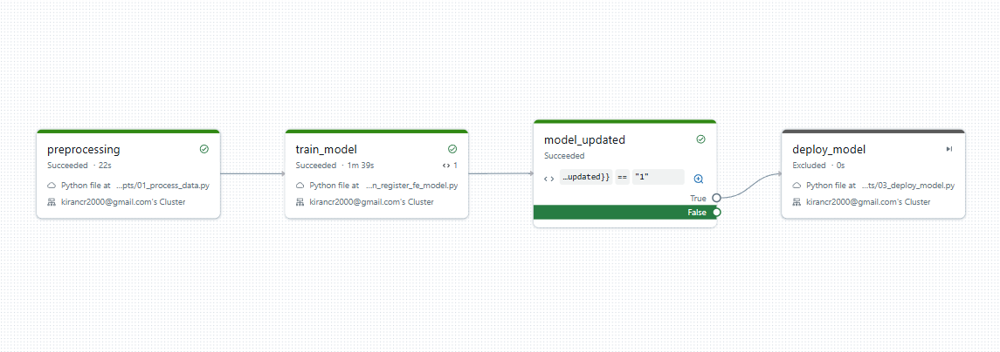
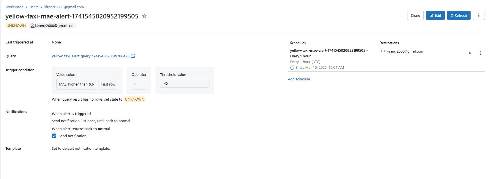

<h1 align="center">
Marvelous MLOps End-to-end MLOps with Databricks course


## Practical information
- Weekly lectures on Wednesdays 16:00-18:00 CET.
- Code for the lecture is shared before the lecture.
- Presentation and lecture materials are shared right after the lecture.
- Video of the lecture is uploaded within 24 hours after the lecture.

- Every week we set up a deliverable, and you implement it with your own dataset.
- To submit the deliverable, create a feature branch in that repository, and a PR to main branch. The code can be merged after we review & approve & CI pipeline runs successfully.
- The deliverables can be submitted with a delay (for example, lecture 1 & 2 together), but we expect you to finish all assignments for the course before the 25th of November.


## Set up your environment
In this course, we use Databricks 15.4 LTS runtime, which uses Python 3.11.
In our examples, we use UV. Check out the documentation on how to install it: https://docs.astral.sh/uv/getting-started/installation/

To create a new environment and create a lockfile, run:

```
uv venv -p 3.11 venv
source venv/bin/activate
uv pip install -r pyproject.toml --all-extras
uv lock
```

### Project Folder Structure
```
├── data/
│   ├── yellow_tripdata_2020-06.csv
├── notebooks/
│   ├── data_processing_notebook.py
│   ├── w2_basic_model_register_notebook.py
│   ├── w2_custom_model_register_notebook.py
│   ├── w3.1_deploy_model_serving_endpoint.py
│   └── w3.3_deploy_feature_serving_endpoint.py
├── scripts/
│   ├── 01_process_data.py
│   ├── 02_train_register_fe_model.py
│   └── 03_deploy_model.py
├── src/
│   ├── yellow_taxi/
│   │   ├── __init__.py
│   │   ├── config.py
│   │   ├── data_processor.py
│   │   ├── utils.py
│   │   ├── models/
│   │   │   ├── __init__.py
│   │   │   ├── basic_model.py
│   │   │   ├── custom_model.py
│   │   │   └── feature_lookup_model.py
│   │   └── serving/
│   │       ├── __init__.py
│   │       ├── fe_model_serving.py
│   │       ├── feature_serving.py
│   │       └── model_serving.py
|── tests/
└       |── test_data_processor.py
├── .gitignore
├── .pre-commit-config.yaml
├── databricks.yml
├── project_config.yml
├── pyproject.toml
├── pytest.ini
├── README.md
├── uv.lock
```


## Directory Structure Explanation
- `notebooks/`: Contains all Databricks notebooks for interactive development
- `scripts/`: Python scripts for automated pipeline execution
- `src/yellow_taxi/`: Core implementation of data processing and model logic
- `tests/`: Unit tests for data processing and model components
- `imgs/`: images


## Weekly Breakdown


### Week 1: Data Processing

- For this project, we use the [New York Yellow Taxi dataset](https://www.kaggle.com/datasets/microize/newyork-yellow-taxi-trip-data-2020-2019) from Kaggle.
- Load dataset from Databricks Unity catalog Volume notebook. (Raw data)
- Perform data cleaning and preprocessing using PySpark or Pandas.
- Save the processed data to a Delta table for further use.

* Key operations performed:
    - Upload the Yellow Taxi dataset to Databricks workspace:
   ```bash
   databricks fs cp data/yellow_tripdata_2020-06.csv dbfs:/data/
   ```
   - Data cleaning using pandas.
   - Feature engineering (is_weekend, payment_discount_type)
   - Save processed data to Delta table 'train_set' and 'test_set' usig PySpark.


### Week 2: Model Training and Registering
- Load the processed data from the Delta table.
- Three models will be registered in MLflow:
   * basic_regressor: Real-time prediction model
   * feature_serving_model: Model with feature lookups
   * custom_model: Model with on-the-fly feature calculation
- Used databricks ["databricks-feature-engineering" "databricks-feature-lookup] packages to create a feature function and feature lookup table(Delta table)
- Train these machine learning Regression ML models using libraries like
     scikit-learn and lightbgm.
- Register the trained model in the Databricks Model Registry using MLFlow library.


### Week 3: Model Serving

- Create separate Databricks endpoints for each regression ML model.
- While deploying the model, create DLT (Delta Live Tables) for feature lookup and create a pipeline from Delta table to Delta Live Table by creating a pipeline to sync the computed feature data.
- Create feature engineering functions using the Databricks feature engineering package to calculate if a particular day is a weekend or not.
- For batch serving or feature serving, create a pipeline FuncSpec to update the new prediction to tables.


### Week 4: Model Deployment using Asset Bundles
- Created an asset bundle containing the model and necessary dependencies
- Generated synthetic data from the existing dataset to simulate real-time feature processing and model deployment
- Deployed the asset bundle to a staging environment for testing
- Implemented automated deployment pipeline for asset bundle creation and deployment
- Databricks Workflow Integration:
  - Created Multi-task workflow for end-to-end model deployment
  - Configured workflow with the following stages:
    1. Data Processing
    2. Model Training & Registration
    3. Model Serving Endpoint Creation
    4. Feature Table Updates


*Figure: Data Processing Pipeline Workflow*


### Week 5: Model Monitoring Activities

#### Overview
During Week 5, significant progress was made in implementing model monitoring for regression ML models, with a particular focus on lakehouse monitoring. This summary outlines the key activities undertaken, including the creation and refreshing of monitoring tables, integration of inference logs, and evaluation of model performance metrics.

#### Key Activities

#### 1. Creation of Monitoring Tables
- Developed a robust monitoring table structure to track model performance over time.
- Utilized the `create_monitoring_table` function to establish the necessary schema and properties for the monitoring table in the lakehouse.

#### 2. Refreshing Monitoring Data
- Implemented the `create_or_refresh_monitoring` function to ensure that the monitoring table is updated with the latest inference data.
- This function parses incoming requests and responses, allowing for real-time tracking of model predictions and actual outcomes.

#### 3. Integration of Inference Logs
- Integrated inference logs to capture detailed information about model predictions, including input features and output predictions.
- This integration enables the identification of potential issues and performance degradation over time.

#### 4. Evaluation of Model Performance Metrics
- Conducted evaluations of model performance metrics to assess the accuracy and reliability of predictions.
- Metrics such as mean absolute error (MAE) and prediction accuracy were monitored to ensure the model meets performance standards.

#### 5. Continuous Improvement
- Established a feedback loop for continuous improvement of the model monitoring process.
- Regular updates and evaluations will be conducted to refine the monitoring framework and enhance model performance.

#### 6. Databricks Alert's.
- Create automated alerts using SQL queries on the `model_monitoring_profile_metrics` table to trigger notifications when the regression model's MAE score exceeds the defined threshold.


*Figure: Databricks Alert*

#### 7. Workflow for monitoring.
- Created a dedicated workflow using asset bundles for continuous model monitoring.
